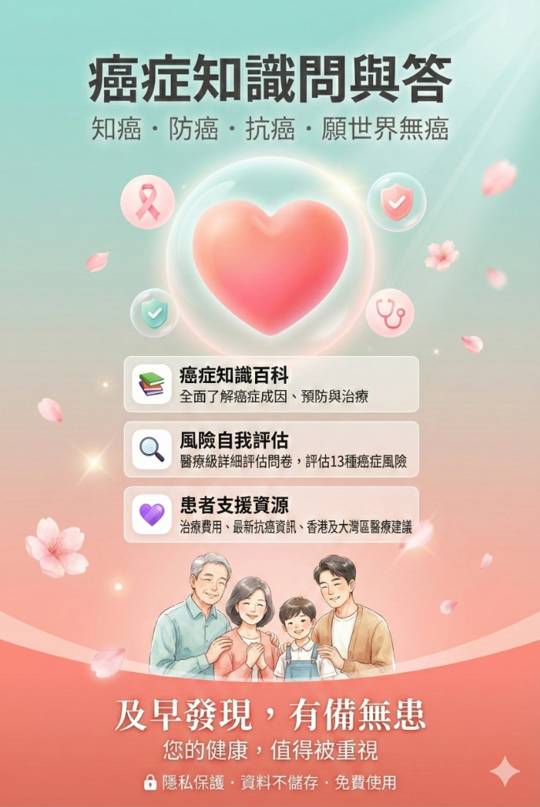

# 癌症全方位防治資訊平台 / Comprehensive Cancer Knowledge Platform

**🌐 https://nathan927.github.io/cancer-knowledge-kit**

> **知癌・防癌・抗癌・願世界無癌**
>
> 癌症的衝擊，不分年齡與身份。我們深知面對疾病時的焦慮與無助。本專案致力於建立一個**專業、客觀且具備醫學參考價值**的資訊系統，協助大眾認識癌症、提早預防，並為患者與家屬提供必要的知識支援。

---

## 🇭🇰 繁體中文

### 關於本專案
面對癌症，知識是我們最強大的防線。「癌症全方位防治資訊平台」旨在整合**醫療級的風險評估**、**實證醫學百科**以及**患者支援資源**，為不同階段的使用者提供專業協助：

1.  **健康人群**：提早識別風險，建立正確的預防觀念。
2.  **癌症患者**：深入了解疾病成因與治療，減少對未知的恐懼。
3.  **家屬與照顧者**：獲取照護指引，尋求適當的社會支援。

### 核心功能詳解

#### 1. 專業風險評估 (Clinical Assessment) 📋
本平台採用嚴謹的醫學標準，協助您客觀評估自身狀況。這不僅僅是一個簡單的問卷，而是一個基於臨床指引的綜合分析工具。

**評估機制：**
*   **多因子運算**：系統會綜合分析您的**年齡、性別、BMI 指數（身高/體重）、家族病史、生活習慣（吸煙、飲酒、運動）及特定身體徵狀**。
*   **13 種癌症覆蓋**：針對肺癌、大腸癌、乳癌（女性）、前列腺癌（男性）、肝癌、胃癌等常見癌症進行獨立風險推算。
*   **動態風險層級**：根據運算結果，將風險劃分為「一般」、「中等」及「高風險」，並提供相應的醫療建議。

**參照臨床指引 (Clinical Guidelines)：**
本工具的設計參考了以下國際權威標準，確保評估結果的科學性與可信度：

*   **🔬 Gail Model (NCI, USA)**
    *   *簡介*：由美國國家癌症研究所 (NCI) 開發的乳癌風險評估工具。
    *   *應用*：利用年齡、初經年齡、生育史及家族病史等因子，精確估算女性在未來 5 年及終身的浸潤性乳癌風險。
*   **🔬 QCancer Algorithms (UK)**
    *   *簡介*：源自英國學術研究的大型風險預測模型。
    *   *應用*：專為基層醫療設計，能綜合年齡、性別、症狀及生活習慣，預測未來 10 年內罹患多種癌症的未調整風險，是目前最全面的綜合評估模型之一。
*   **🔬 NICE NG12 指引 (NICE, UK)**
    *   *簡介*：英國國家健康與臨床卓越機構 (NICE) 發布的「疑似癌症識別與轉介」指引。
    *   *應用*：本平台利用此指引的標準來識別潛在的「紅旗徵狀」(Red Flag Symptoms)，提醒使用者何時應立即尋求醫療協助，以避免延誤診斷。
*   **🔬 USPSTF 篩檢建議 (USA)**
    *   *簡介*：美國預防服務工作小組 (USPSTF) 的實證醫學建議。
    *   *應用*：根據您的年齡與風險層級，對照 USPSTF 的標準，提供最具科學依據的「篩檢時程建議」（如大腸鏡、乳房造影的起始年齡）。

#### 2. 癌症醫學百科與互動學習 (Knowledge & Interactive Learning) 📚
對抗疾病，始於正確的認知。我們建立了一個基於科學實證、持續更新的知識庫，並結合互動功能加深學習效果。

*   **癌症基本概念**：深入淺出解釋細胞變異、腫瘤形成及良性/惡性的區別。
*   **主要成因與風險因子**：詳列遺傳、環境（如致癌物）、生活方式對癌症的影響。
*   **常見症狀與警訊**：依癌症類別整理常見的早期徵兆，幫助您自我察覺。
*   **診斷與治療**：介紹現代化的診斷工具（如切片、PET Scan）及主流治療手段（手術、化療、標靶治療、免疫療法、CAR-T）。
*   **科學闢謠 (Myth Busting)**：針對坊間流傳的錯誤觀念（例如「酸性體質」、「斷食餓死癌細胞」）提供醫學證據進行澄清。
*   **預防策略**：整合中西醫理念，提供具體可行的生活建議，包括飲食調節、運動處方及心理健康維護。
*   **互動問答 (Quiz)**：透過情境式問答題，協助使用者檢視對癌症知識的掌握程度，加深對預防重點的理解。

#### 3. 中西醫結合與全人護理 (Holistic Care) 🌿
我們關注患者的身心靈需求，不僅提供西醫資訊，更整合了輔助療法與生活調理建議：

*   **中醫食療指南**：
    *   針對化療後的常見副作用（如噁心、食慾不振、手腳麻痺），提供具體的**藥膳湯水食譜**（如滋陰潤燥的雪耳百合湯、補氣養血的黃芪雞湯）。
    *   詳列抗癌食材及其藥理屬性（健脾、益氣、清熱等）。
*   **中港醫療資訊**：提供香港與內地中醫服務的參考費用、就醫流程建議，以及大灣區醫療合作的最新資訊。
*   **癌痛管理**：介紹 WHO 三階梯止痛原則，導正大眾對止痛藥（如嗎啡）的成癮迷思，強調改善生活品質的重要性。

#### 4. 關懷與資源支援 (Social Support Resources) ❤️
治療之路漫長且艱辛，我們整理了切實可用的社會資源，陪伴您與家人同行：

*   **經濟援助**：詳列各類資助計劃的申請資格與方法，包括：
    *   **關愛基金 (Community Care Fund)** 首階段及極昂貴藥物資助。
    *   **撒瑪利亞基金**。
    *   社會福利署**綜合社會保障援助 (CSSA)** 及**傷殘津貼**。
*   **康復與心理支援**：
    *   **香港癌症基金會**：提供免費心理輔導、營養諮詢及瑜伽/泰極班。
    *   **香港防癌會**：提供慈善醫藥資助、癌症康復中心護理服務。
    *   **銘琪癌症關顧中心 (Maggie's Centre)**：提供舒適的環境與情緒支援小組。
*   **照顧者指南**：為陪伴者提供實用的照護技巧（如傷口護理、造口護理）與減壓建議。

### 隱私與安全
健康資訊屬於個人私隱。本工具承諾：
*   **資料不儲存**：所有評估均在您的瀏覽器本地端進行運算。
*   **無追蹤**：我們不會收集、上傳或記錄您的任何個人資料。

---

## 🇬🇧 English

### About This Project
Knowledge is our strongest defense against cancer. The **Comprehensive Cancer Knowledge Platform** is designed to integrate **medical-grade risk assessment**, an **evidence-based medical encyclopedia**, and **patient support resources** to assist users at every stage:

1.  **For Prevention**: Early risk identification and establishing correct preventive concepts.
2.  **For Patients**: Understanding disease etiology and treatment to reduce fear of the unknown.
3.  **For Caregivers**: acquiring care guidelines and identifying appropriate social support.

### Detailed Features

#### 1. Clinical Assessment 📋
This platform utilizes rigorous medical standards to help you objectively assess your condition. This is not a simple quiz, but a comprehensive analysis tool based on clinical guidelines.

**Assessment Mechanism:**
*   **Multi-Factor Algorithms**: The system analyzes your **Age, Gender, BMI, Family History, Lifestyle (Smoking, Alcohol, Exercise), and Specific Symptoms**.
*   **13 Cancer Types**: Independent risk calculations for common cancers including Lung, Colorectal, Breast, Prostate, Liver, and Gastric cancer.
*   **Dynamic Risk Stratification**: Results are categorized into "Average", "Moderate", or "High" risk, with corresponding medical recommendations.

**Referenced Clinical Guidelines:**
To ensure scientific accuracy and credibility, this tool incorporates the following international authorities:

*   **🔬 Gail Model (NCI, USA)**
    *   *Overview*: A breast cancer risk assessment tool developed by the National Cancer Institute.
    *   *Application*: Uses factors like menstrual history and family history to estimate a woman's 5-year and lifetime risk of invasive breast cancer.
*   **🔬 QCancer Algorithms (UK)**
    *   *Overview*: Large-scale risk prediction models from UK academic research.
    *   *Application*: Designed for primary care, it integrates age, symptoms, and lifestyle to predict the absolute risk of multiple cancers over the next 10 years.
*   **🔬 NICE NG12 Guidelines (NICE, UK)**
    *   *Overview*: "Suspected cancer: recognition and referral" guidelines by the National Institute for Health and Care Excellence.
    *   *Application*: Used to identify "Red Flag Symptoms" within the assessment, prompting users to seek immediate medical attention for potential malignancies.
*   **🔬 USPSTF Recommendations (USA)**
    *   *Overview*: Evidence-based recommendations from the U.S. Preventive Services Task Force.
    *   *Application*: Provides scientifically grounded "Screening Schedules" (e.g., for colonoscopy or mammography) based on your age and calculated risk level.

#### 2. Medical Encyclopedia & Interactive Learning 📚
Fighting cancer begins with correct understanding. We maintain a scientifically verified knowledge base covering:

*   **Basic Concepts**: Explaining cell mutation, tumor formation, and benign vs. malignant distinctions.
*   **Causes & Risk Factors**: Detailed breakdown of genetic, environmental, and lifestyle influences.
*   **Symptoms & Warning Signs**: Categorized early signs for specific cancer types to aid self-awareness.
*   **Diagnosis & Treatment**: Introductions to modern diagnostics and treatments (Surgery, Chemotherapy, Targeted Therapy, Immunotherapy, CAR-T).
*   **Myth Busting**: Clarifying common misconceptions (e.g., "Acidic Body Constitution", "Starving Cancer Cells") with medical evidence.
*   **Prevention Strategies**: Actionable lifestyle advice, including dietary adjustments and exercise prescriptions.
*   **Interactive Quiz**: A Q&A feature designed to reinforce understanding of cancer prevention and detection through active engagement.

#### 3. Holistic Care & TCM Integration 🌿
We address the physical and needs of patients beyond conventional medicine:

*   **TCM Dietary Therapy**:
    *   Providing Traditional Chinese Medicine dietary guides (e.g., soups for "Nourishing Yin" or "Qi and Blood Tonifying") to alleviate chemotherapy side effects like nausea and fatigue.
    *   Detailed list of anti-cancer ingredients and their TCM properties.
*   **Cross-Border Medical Info**: Comparing medical service costs and accessibility between Hong Kong and Mainland China (Greater Bay Area).
*   **Pain Management**: Educating on WHO pain relief principles to improve quality of life and dispel addiction myths regarding morphine.

#### 4. Social Support & Resources ❤️
The journey of treatment is long. We organize resources to support you and your family:

*   **Financial Assistance**: Detailed guidance on applying for:
    *   **Community Care Fund (CCF)** Medical Assistance Programmes.
    *   **Samaritan Fund**.
    *   **CSSA** and **Disability Allowance**.
*   **Rehabilitation Support**:
    *   **Hong Kong Cancer Fund**: Free professional counseling and wellness programs.
    *   **The Hong Kong Anti-Cancer Society**.
    *   **Maggie's Cancer Caring Centre**.
*   **Caregiver Guide**: Practical care tips (wound care, stoma care) and stress management advice.

---

**Medical Disclaimer / 醫療免責聲明**
> This platform is for educational purposes only and does not constitute a medical diagnosis. If you have health concerns, please consult a qualified healthcare professional.
> 本平台僅供教育參考，**不構成任何醫療診斷**。如有任何健康疑慮，請務必諮詢專業醫療人員。

© 2024-2026 Comprehensive Cancer Knowledge Platform.
